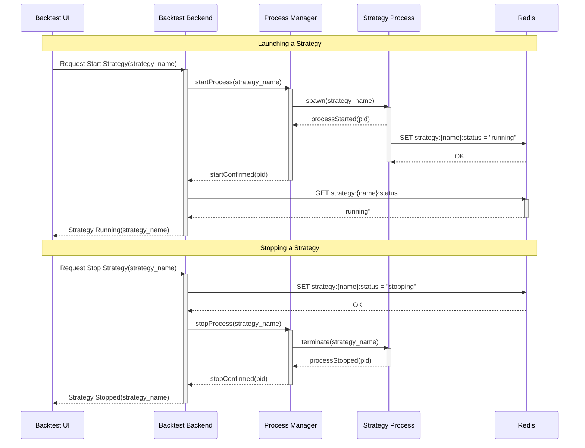

# Live Strategy Execution Lifecycle

This document describes the lifecycle of a live trading strategy, specifically focusing on the start and stop processes managed by the Backtest Engine and the `ksai_proc` utility.

## Overview

The execution of live strategies involves coordination between several components:
- **Backtest UI**: The user interface where commands are initiated.
- **Backtest Backend (API)**: The server handling requests and orchestration.
- **Process Manager (PM)**: The `ksai_proc` utility responsible for spawning and managing OS processes.
- **Strategy Process (SP)**: The actual running instance of a trading strategy.
- **Redis (Cache)**: Used for state management and inter-process communication.

## Process Manager (`ksai_proc`)

The Process Manager is a custom utility executed via the command line.

- **Start**: `ksai_proc --name <process_name> <command>`
  - Example: `ksai_proc --name strategy_alpha uv run strategy_alpha.py`
- **Stop**: `ksai_proc stop --name <process_name>`

## Lifecycle Sequence

The following sequence diagram illustrates the interactions during the start and stop phases.

## Detailed Flow

### Launching a Strategy

1.  **Request**: The user requests to start a strategy via the **Backtest UI**.
2.  **Orchestration**: The **Backtest Backend (API)** receives this request and calls the **Process Manager (PM)** to start the process.
3.  **Spawning**: The PM spawns the **Strategy Process (SP)** using `ksai_proc`.
4.  **Registration**:
    *   The SP starts up and immediately registers its status as "running" in **Redis**.
    *   The PM confirms the process launch (PID) back to the API.
5.  **Verification**: The API verifies the "running" status from Redis to ensure the strategy is active and communicating.
6.  **Confirmation**: The API responds to the UI that the strategy is running.

### Stopping a Strategy

1.  **Request**: The user requests to stop a strategy via the **Backtest UI**.
2.  **Status Update**: The **API** immediately updates the status in **Redis** to "stopping". This serves as a signal to other components and prevents new actions.
3.  **Termination**: The API instructs the **Process Manager** to stop the specific strategy process.
4.  **Shutdown**:
    *   The PM sends a termination signal to the **Strategy Process**.
    *   The SP shuts down, and the PM confirms the stop to the API.
5.  **Confirmation**: The API responds to the UI that the strategy has been stopped.
